# Stage 01 - Manual Installation

The following describes the manual installation of Talos Linux (<https://www.siderolabs.com/talos-linux>), the included Kubernetes with Cilium and some sanity tests to verify correct functionality.
The installation uses Proxmox Virtualization (<https://www.proxmox.com/en/products/proxmox-virtual-environment/overview>), but could be executed on bare metal with very few changes.

## Sources

<https://docs.siderolabs.com/talos/v1.13/platform-specific-installations/virtualized-platforms/proxmox>

<https://docs.siderolabs.com/talos/v1.13/getting-started/getting-started>

<https://docs.siderolabs.com/talos/v1.13/getting-started/prodnotes>

<https://docs.siderolabs.com/talos/v1.13/configure-your-talos-cluster/system-configuration/patching>

## Create Talos ISO

Go to the Talos Image Factory: <https://factory.talos.dev/>

On the “Hardware Type“ dialog, select “Cloud Server“ and select “Next“.

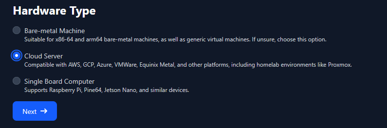

On the “Choose Talos Linux Version” dialog, choose the latest version (v1.13.8 at the time of writing) and select “Next“.

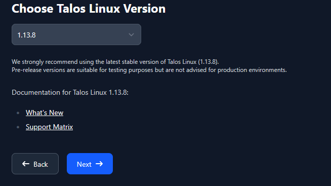

On the “Cloud” dialog, for a VM running on Proxmox, choose “nocloud“ and select “Next“.

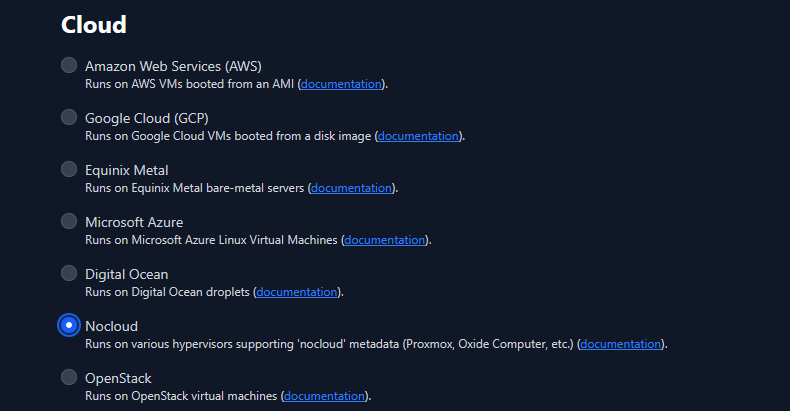

On the “Machine Architecture” dialog, choose “amd64“ and enable “SecureBoot”. Select “Next“.

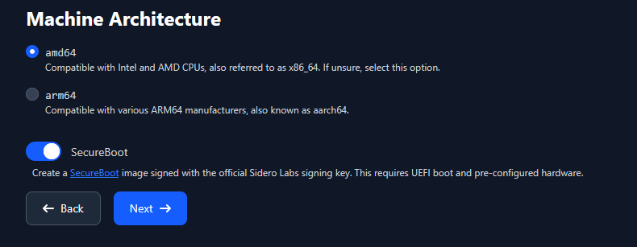

On the “System Extensions” dialog, search for “qemu“, enable “siderolabs/qemu-guest-agent“ and select “Next“.

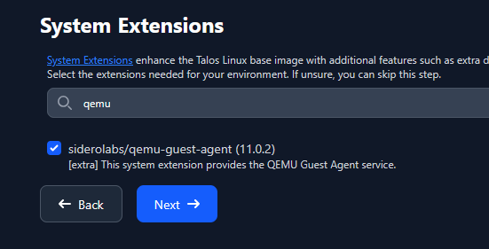

On the “Customization” dialog, set “Bootloader” to “auto”. Select “Next”.

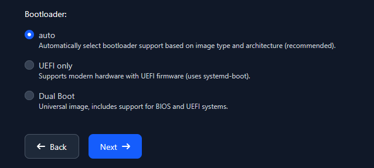

Download the secure boot ISO: <https://factory.talos.dev/image/ce4c980550dd2ab1b17bbf2b08801c7eb59418eafe8f279833297925d67c7515/v1.13.8/nocloud-amd64-secureboot.iso>

Note down

- The “image Schematic ID”: ce4c980550dd2ab1b17bbf2b08801c7eb59418eafe8f279833297925d67c7515

- The initial installation image: factory.talos.dev/nocloud-installer-secureboot/ce4c980550dd2ab1b17bbf2b08801c7eb59418eafe8f279833297925d67c7515:v1.13.8

## Upload ISO to Proxmox

Access your Proxmox Web UI. Navigate to the local disk of the node where you want to upload the ISO (“pve” &rarr; “local (pve)” in my case). There select “ISO Images”.

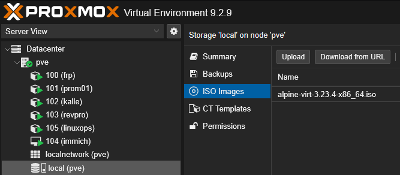

Select “Upload”, and “Select File” where you can select the ISO previously downloaded. Confirm with “Upload”

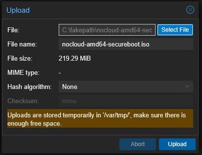

## Create a new VM in Proxmox

Select “Create VM”.

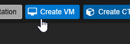

On the “General” tab, name the new VM. Select “Next”.

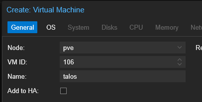

On The “OS” tab, select the previously uploaded ISO image. Select “Next”.

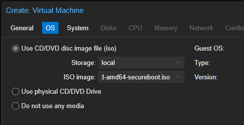

On the “System” tab, select

- “Machine” to “q35”
- “BIOS” to “OVMF (UEFI)”
- “EFI Storage” to a suitable disk
- Uncheck “Pre-Enroll keys” (otherwise your machine will not boot!)
- “SCSI Controller” to “VirtIO SCSI” (not “VirtIO SCSI Single”)
- Enable “Qemu agent”
- “Add TPM” and select a suitable disk. Select “Next”

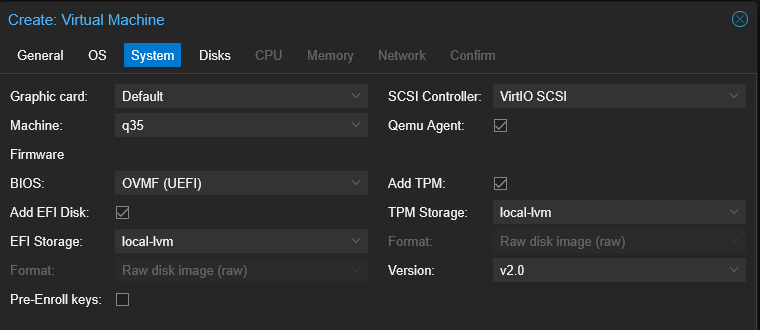

On the “Disks” tab, keep the size of the first, OS-disk at 32GB, set “Cache” to “No cache” and enable “Discard”. Select “Next”.

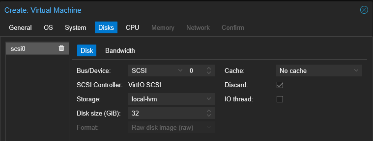

Add a second disk for data. Use the same parameters but choose a suitable size for your workload.

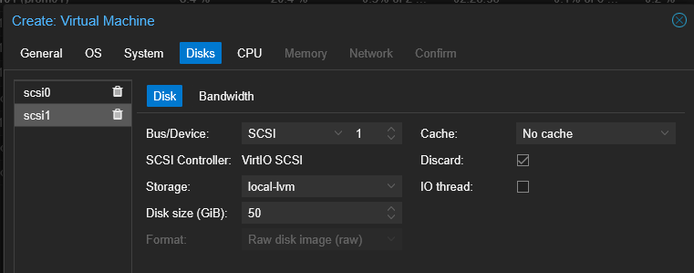

On the “CPU” tab, set “Cores” to at least “4” (for combined nodes) or more depending on your workloads. Set “Type” to “host”. Select “Next”.

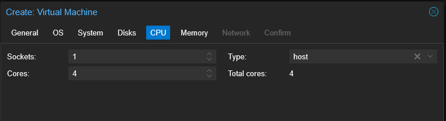

On the “Memory” tab, set “Memory” to “8192” (8GB) or more. Select “Next”.

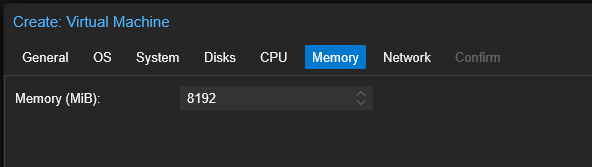

On the “Network” tab, choose the correct network bridge. Select “Next”.

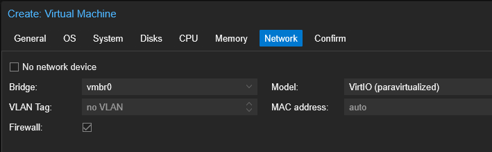

On the “Confirm” tab, double-check all your settings and then select “Finish”.

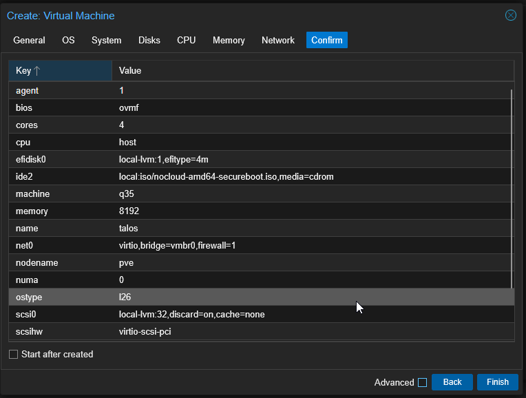

Repeat the process two more times, if you want to build a cluster.

## Setup DHCP

Navigate to the newly created VM(s), “Hardware” and find the “Network Device”. Copy the MAC address(es).

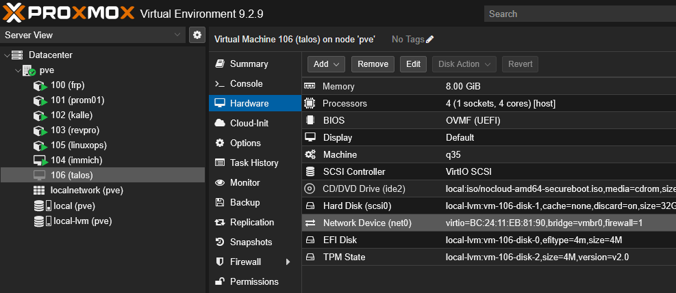

In your DHCP server, reserve a suitable IP address for that MAC address, so that the Talos machine will always get the same IP.

You can use the DHCP server to set the hostname of the machine as well.

## Boot the node

Start the node(s) and watch the console. You should see it boot to Talos. The “STAGE” should be “Maintenance” and “SECUREBOOT” should be “true”. If you set the hostname via DHCP, you should see it here.

Verify that the machine has received the correct IP address and has network connectivity (“CONNECTIVITY” = “OK”).

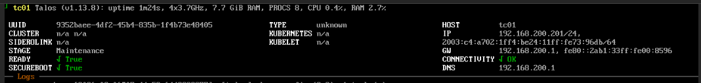

## Unmount the ISO in Proxmox

In Proxmox, navigate to the VM, “Hardware” and edit “CD/DVD drive”.

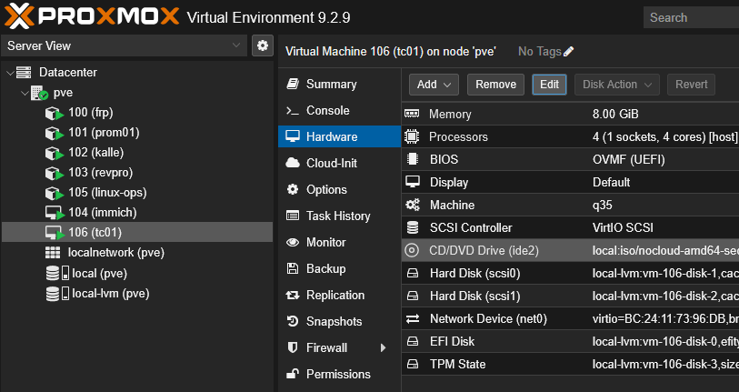

Set to “Do not use any media” and confirm.

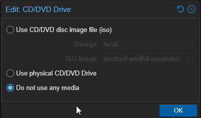

## Prepare a deployment machine

Install a Linux box using the latest Ubuntu LTS.

Install curl.

```bash
sudo apt install curl
```

Install the Talos control binary (<https://docs.siderolabs.com/talos/v1.13/getting-started/talosctl>).

```bash
curl -sL https://talos.dev/install | sh
```

Download kubectl.

```bash
curl -LO "https://dl.k8s.io/release/$(curl -L -s https://dl.k8s.io/release/stable.txt)/bin/linux/amd64/kubectl"
```

Make the binary executable and move it to /usr/bin/local.

```bash
sudo install -o root -g root -m 0755 kubectl /usr/local/bin/kubectl
```

Install Helm.

```bash
curl -fsSL -o get_helm.sh https://raw.githubusercontent.com/helm/helm/main/scripts/get-helm-4
chmod 700 get_helm.sh
./get_helm.sh
```

Install yq.

```bash
sudo apt install yq -y
```

Install Cilium CLI.

```bash
CILIUM_CLI_VERSION=$(curl -s https://raw.githubusercontent.com/cilium/cilium-cli/main/stable.txt)
CLI_ARCH=amd64
curl -L --fail --remote-name-all https://github.com/cilium/cilium-cli/releases/download/${CILIUM_CLI_VERSION}/cilium-linux-${CLI_ARCH}.tar.gz{,.sha256sum}
sha256sum --check cilium-linux-${CLI_ARCH}.tar.gz.sha256sum
sudo tar xzvfC cilium-linux-${CLI_ARCH}.tar.gz /usr/local/bin
rm cilium-linux-${CLI_ARCH}.tar.gz{,.sha256sum}
```

## Create configuration

Folder: `./infra/talos`

Set the IPs of your nodes as environment variable.

Single Node:

```bash
export CONTROL_PLANE_IP=192.168.200.201
```

Three Node:

```bash
export CONTROL_PLANE_IP=("192.168.200.201" "192.168.200.202" "192.168.200.203")
```

Export your endpoint URL into an environment variable.

```bash
export MY_ENDPOINT=https://tc.jku.internal:6443
```

For each of your nodes, add an A record into your DNS server with the node’s IP and the endpoint name.

Single Node:

```text
tc.jku.internal IN A 192.168.200.201
```

Three Node:

```text
tc.jku.internal IN A 192.168.200.201
tc.jku.internal IN A 192.168.200.202
tc.jku.internal IN A 192.168.200.203
```

Generate the cluster secrets.

```bash
talosctl gen secrets -o secrets.yaml
```

Export your cluster name into an environment variable.

```bash
export CLUSTER_NAME=talos-cluster
```

Generate the basic configuration.

```bash
talosctl gen config --with-secrets secrets.yaml $CLUSTER_NAME $MY_ENDPOINT
```

## Patch the configuration

Create a new folder “patches”.

### Installation Disk Patch

Check the disk names of the VM

```bash
talosctl get disks --insecure --nodes 192.168.200.201
```

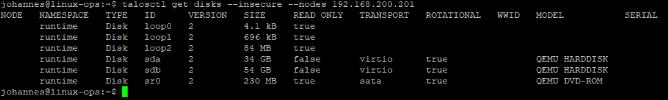

Create “patches/patch-disk.yaml” and replace “/dev/sda” with your installation disk.

```yaml
# Set installation disk
machine:
  install:
    disk: /dev/sda
```

### Installation Image Patch

Create “patches/patch-installation-image.yaml” and replace the URL after “image:” with the URL you gathered from the image factory.

```yaml
# Set the installation image used. Needs the secureboot variety, if secureboot is used
machine:
  install:
    image: factory.talos.dev/nocloud-installer-secureboot/ce4c980550dd2ab1b17bbf2b08801c7eb59418eafe8f279833297925d67c7515:v1.13.8
```

### Network Device Patch

Check the network interface names.

```bash
talosctl --nodes 192.168.200.201 get links --insecure
```

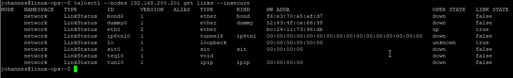

Create “patches/patch-network-dev.yaml” and replace “eth0” with your network interface.

```yaml
# Set network interface
machine:
  network:
    interfaces:
      - interface: eth0
        dhcp: true
```

### Enable Disk Encryption with TPM

Create “patches/patch-tpm-disk-enc.yaml”.

```yaml
# Enable TPM-based disk encryption
machine:
  systemDiskEncryption:
    ephemeral:
      provider: luks2
      keys:
        - slot: 0
          tpm: {}
    state:
      provider: luks2
      keys:
        - slot: 0
          tpm: {}
```

### Allow workloads on controlplanes

To allow running workloads on the controlplane nodes, create “patches/patch-controlplane-run.yaml”.

```yaml
# Enable running workloads on controlplane nodes
cluster:
    allowSchedulingOnControlPlanes: true
```

### Metrics server with certificate rotation

To use the metrics server, certificate rotation must be enabled. Create “patches/patch-metrics-server.yaml”

```yaml
# Enable certificate rotation and install metrics server
machine:
  kubelet:
    extraArgs:
      rotate-server-certificates: true
cluster:
  extraManifests:
    - https://raw.githubusercontent.com/alex1989hu/kubelet-serving-cert-approver/main/deploy/standalone-install.yaml
    - https://github.com/kubernetes-sigs/metrics-server/releases/latest/download/components.yaml
```

### Disable default CNI

To use Cilium (installed later), you need to disable the default CNI and kube-proxy as well. Create “patches/patch-no-cni.yaml”.

```yaml
# Disable default CNI and kube-proxy. Will be replaced by Cilium
cluster:
  network:
    cni:
      name: none
  proxy:
    disabled: true
```

### Cilium Configuration

Folder: `./infra/cilium`

Since we want to use Cilium’s Gateway API we need the corresponding CRDs.

```bash
curl -L https://github.com/kubernetes-sigs/gateway-api/releases/download/v1.6.1/standard-install.yaml  -o gateway-api.yaml
```

Now create the cilium-values.yaml with the following contents.

```yaml
# Cilium Helm values for Talos Linux
#
# Assumptions:
# - Talos CNI is set to "none"
# - Talos kube-proxy is disabled
# - Talos KubePrism is enabled on localhost:7445
# - Talos default Pod CIDR (10.244.0.0/16) and Service CIDR (10.96.0.0/12)
# - Cilium overlay routing using VXLAN
# - Cilium Gateway API enabled
# - Cilium L2 Announcements enabled
# - Hubble + Relay + UI enabled
#
# Intended for Cilium 1.20.x.

# ---------------------------------------------------------------------------
# Talos-specific settings
# ---------------------------------------------------------------------------

ipam:
  mode: kubernetes

kubeProxyReplacement: true

# Use Talos KubePrism as the Kubernetes API endpoint.
k8sServiceHost: localhost
k8sServicePort: 7445

# Talos already provides the cgroup v2 mount.
cgroup:
  autoMount:
    enabled: false
  hostRoot: /sys/fs/cgroup

# Talos does not permit Kubernetes workloads to load kernel modules,
# so SYS_MODULE is deliberately omitted.
securityContext:
  capabilities:
    ciliumAgent:
      - CHOWN
      - KILL
      - NET_ADMIN
      - NET_RAW
      - IPC_LOCK
      - SYS_ADMIN
      - SYS_RESOURCE
      - DAC_OVERRIDE
      - FOWNER
      - SETGID
      - SETUID

    cleanCiliumState:
      - NET_ADMIN
      - SYS_ADMIN
      - SYS_RESOURCE

# ---------------------------------------------------------------------------
# Routing
# ---------------------------------------------------------------------------

# Keep Pod networking self-contained in an overlay.
routingMode: tunnel
tunnelProtocol: vxlan

# ---------------------------------------------------------------------------
# Layer 7 / Gateway API
# ---------------------------------------------------------------------------

# Required for Cilium Gateway API; explicitly set even though it is enabled
# by default.
l7Proxy: true

gatewayAPI:
  enabled: true

  gatewayClass:
    create: true

  # Enables HTTP/2 negotiation (useful for gRPC) and appProtocol support.
  enableAlpn: true
  enableAppProtocol: true

# ---------------------------------------------------------------------------
# LoadBalancer advertisement
# ---------------------------------------------------------------------------

# LB IPAM itself does not need a Helm enable flag.
# Define CiliumLoadBalancerIPPool resources separately.
l2announcements:
  enabled: true

# ---------------------------------------------------------------------------
# Hubble
# ---------------------------------------------------------------------------

hubble:
  enabled: true

  relay:
    enabled: true

  ui:
    enabled: true

  # Keep Cilium's built-in automatic Hubble mTLS certificate management
  # for the initial installation. This does not depend on cert-manager.
  tls:
    enabled: true
    auto:
      enabled: true
      method: cronJob

# ---------------------------------------------------------------------------
# Operator
# ---------------------------------------------------------------------------
operator:
  replicas: 1
```

Adjust the number of replicas to “1” for a single node system and “2” for a multi-node system.

Now create the Helm template for Cilium.

```bash
helm repo add cilium https://helm.cilium.io/
helm repo update
helm template cilium cilium/cilium --version 1.20.0 --namespace kube-system --values cilium-values.yaml > cilium.yaml
```

Folder: `./infra/talos`

Combine all the files into the patch needed for Talos.

```bash
yq -n --rawfile gateway ../cilium/gateway-api.yaml --rawfile cilium ../cilium/cilium.yaml '{ "cluster": { "inlineManifests": [ { "name": "gateway-api", "contents": $gateway }, { "name": "cilium", "contents": $cilium } ] } }' > "patches/patch-cilium.yaml"
```

### Consolidate configuration into single file

Patch controlplane.yaml.

```bash
talosctl machineconfig patch controlplane.yaml -p @patches/patch-disk.yaml -p @patches/patch-installation-image.yaml -p @patches/patch-network-dev.yaml -p @patches/patch-tpm-disk-enc.yaml -p @patches/patch-controlplane-run.yaml -p @patches/patch-metrics-server.yaml -p @patches/patch-no-cni.yaml -p @patches/patch-cilium.yaml -o controlplane-patched.yaml
```

Patch worker.yaml.

```bash
talosctl machineconfig patch worker.yaml -p @patches/patch-disk.yaml -p @patches/patch-installation-image.yaml -p @patches/patch-network-dev.yaml -p @patches/patch-tpm-disk-enc.yaml -p @patches/patch-metrics-server.yaml -p @patches/patch-no-cni.yaml -o worker-patched.yaml
```

## Apply the configuration

Apply the configuration.

```bash
talosctl apply-config --insecure --nodes 192.168.200.201 --file controlplane-patched.yaml
```

Watch the VM console. The VM should apply the configuration. “STAGE” should now be “Installing”.

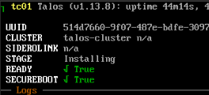

Then the VM should reboot. Wait until the VM is back up and “KUBELET” is “healthy”.

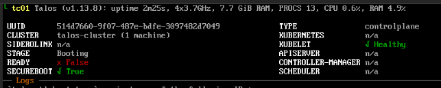

Repeat these steps for the other nodes.

After you complete the process for multiple nodes, you should see that the nodes now belong to the cluster. Also, you should see the number of nodes.

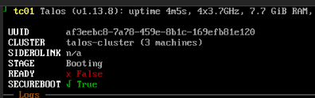

## Bootstrap the cluster

Merge the new talosconfig into the default config

```bash
talosctl config merge ./talosconfig
```

Set the endpoints of your controlplane nodes.

Single Node:

```bash
talosctl config endpoint 192.168.200.201
```

Three Node:

```bash
talosctl config endpoint 192.168.200.201 192.168.200.202 192.168.200.203
```

Run the bootstrap command on a single controlplane node only.

```bash
talosctl bootstrap --nodes 192.168.200.201
```

Wait until your machine(s) are all healthy and ready and “STAGE” is “Running”.

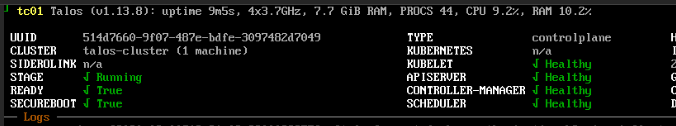

## Kubernetes Access

Download the kubeconfig.

```bash
talosctl kubeconfig --nodes 192.168.200.201
```

## Finish Cilium config

Add the Cilium Loadbalancer IP Pool into “infra/cilium/lb_ip_pool.yaml”

```yaml
apiVersion: cilium.io/v2
kind: CiliumLoadBalancerIPPool
metadata:
  name: lan-pool
spec:
  blocks:
    - start: "192.168.200.220"
      stop: "192.168.200.239"
```

Add the Cilium L2 Announcement Policies into “infra/cilium/lb_l2_policy.yaml”

```yaml
apiVersion: cilium.io/v2alpha1
kind: CiliumL2AnnouncementPolicy
metadata:
  name: lan-l2-policy
spec:
  loadBalancerIPs: true
```

Apply the files.

```bash
kubectl apply -f infra/cilium/lb_ip_pool.yaml
kubectl apply -f infra/cilium/lb_l2_policy.yaml
```

Verify.

```bash
kubectl get ciliumloadbalancerippools
```

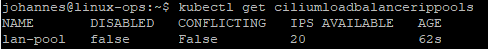

```bash
kubectl get ciliuml2announcementpolicies
```

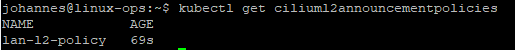

## Sanity Checks

```bash
talosctl --nodes 192.168.200.201 health
```

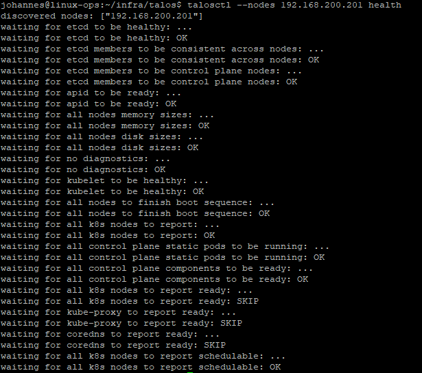

```bash
kubectl get nodes -o wide
```

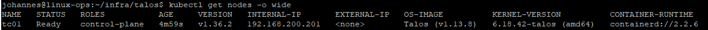

```bash
kubectl get pods -A -o wide
```

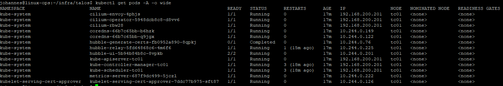

```bash
kubectl get gatewayclass
```

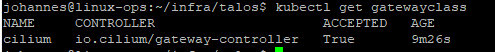

```bash
kubectl get svc -A
```

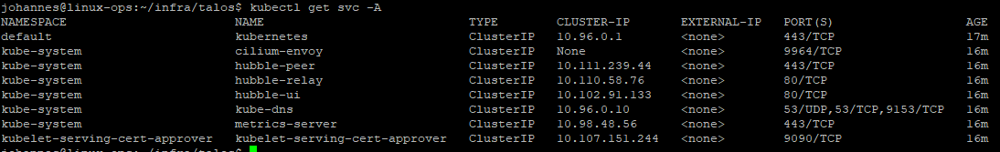

```bash
cilium status
```

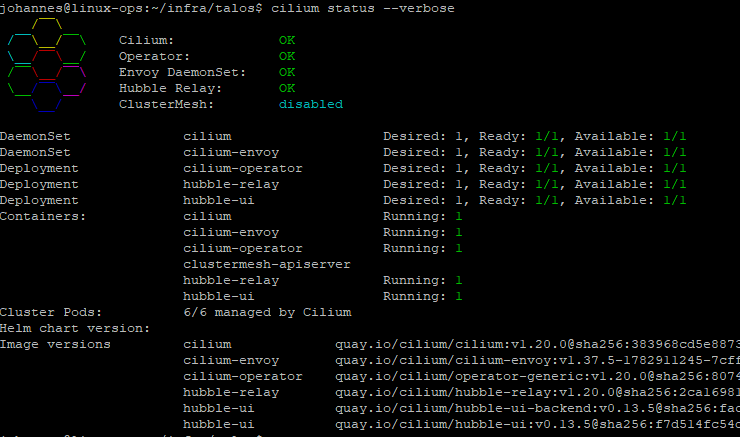

## Extended Sanity Checks

### Test Networking and DNS

Create a “nettest” pod, observing the Talos preset PSA by passing in a security context.

nettest.yaml:

```yaml
apiVersion: v1
kind: Pod
metadata:
  name: nettest
spec:
  securityContext:
    runAsNonRoot: true
    runAsUser: 100
    seccompProfile:
      type: RuntimeDefault
  containers:
    - name: nettest
      image: curlimages/curl
      command: ["sleep", "3600"]
      securityContext:
        allowPrivilegeEscalation: false
        capabilities:
          drop:
            - ALL
```

Apply

```bash
kubectl apply -f nettest.yaml
```

Verify that the pod is running.

```bash
kubectl get pod nettest -o wide
```

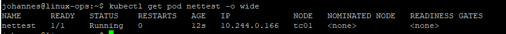

Test the name resolution of the Kubernetes API service.

```bash
kubectl exec nettest -- nslookup kubernetes.default.svc.cluster.local
```

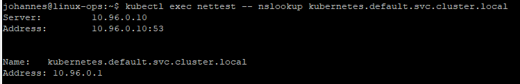

Test access through the API service.

```bash
kubectl exec nettest -- curl -k https://kubernetes.default.svc.cluster.local
```

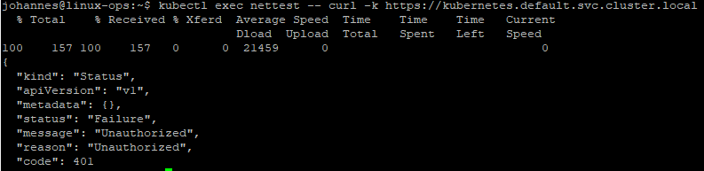

“Unauthorized” is expected.

Test external DNS and connectivity.

```bash
kubectl exec nettest -- curl -I https://www.google.com
```

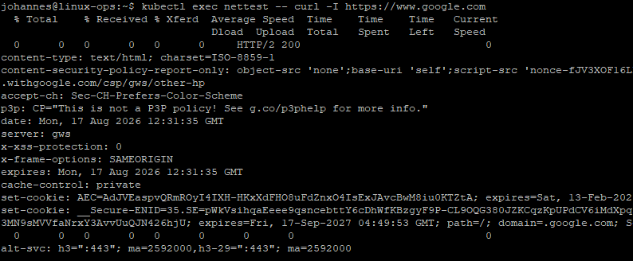

Finally, delete the pod.

```bash
kubectl delete pod nettest
```

### Test access to a service from the outside

Create a Docker Personal Access Token

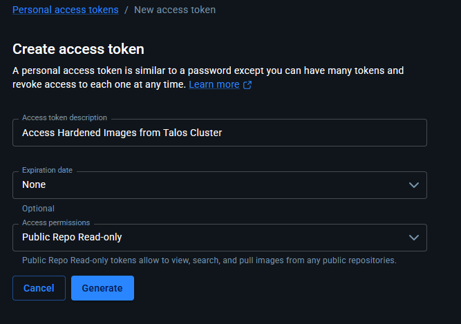

Create a secret in the cluster containing your Docker Personal Access Token:

```bash
kubectl create secret docker-registry dhi-registry \
  --docker-server=dhi.io \
  --docker-username='<YOUR_DOCKER_USERNAME>' \
  --docker-password='<YOUR_DOCKER_ACCESS_TOKEN>'
```

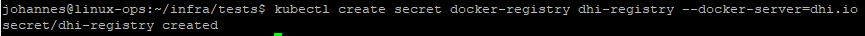

Save the following 2 replica deployment of nginx referencing the secret to “infra/tests/nginx.yaml”.

```yaml
apiVersion: apps/v1
kind: Deployment
metadata:
  name: nginx
  namespace: default
spec:
  replicas: 2
  selector:
    matchLabels:
      app: nginx
  template:
    metadata:
      labels:
        app: nginx
    spec:
      imagePullSecrets:
        - name: dhi-registry
      securityContext:
        runAsNonRoot: true
        seccompProfile:
          type: RuntimeDefault

      containers:
        - name: nginx
          image: dhi.io/nginx:1.31.3-alpine3.23

          ports:
            - name: http
              containerPort: 8080
              protocol: TCP

          securityContext:
            allowPrivilegeEscalation: false
            capabilities:
              drop:
                - ALL

          resources:
            requests:
              cpu: 25m
              memory: 32Mi
            limits:
              cpu: 250m
              memory: 128Mi

---
apiVersion: v1
kind: Service
metadata:
  name: nginx
  namespace: default
spec:
  selector:
    app: nginx
  ports:
    - name: http
      port: 80
      targetPort: 8080
      protocol: TCP
  type: ClusterIP
```

Deploy the workload.

```bash
kubectl apply -f nginx.yaml
```

Check the following items.

```bash
kubectl get deployment nginx
```

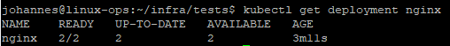

```bash
kubectl get pods -l app=nginx -o wide
```

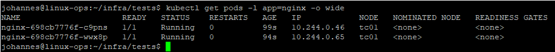

```bash
kubectl get svc nginx
```

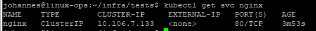

```bash
kubectl get endpointslice -l kubernetes.io/service-name=nginx
```

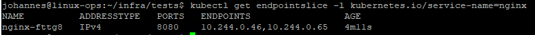

Add the HTTPROUTE config for Cilium. Save the following as “infra/tests/nginx-gateway.yaml”.

```yaml
apiVersion: gateway.networking.k8s.io/v1
kind: Gateway
metadata:
  name: nginx-gateway
  namespace: default
spec:
  gatewayClassName: cilium
  listeners:
    - name: http
      protocol: HTTP
      port: 80
      allowedRoutes:
        namespaces:
          from: Same

---
apiVersion: gateway.networking.k8s.io/v1
kind: HTTPRoute
metadata:
  name: nginx
  namespace: default
spec:
  parentRefs:
    - name: nginx-gateway

  rules:
    - matches:
        - path:
            type: PathPrefix
            value: /
      backendRefs:
        - name: nginx
          port: 80
```

Apply the config.

```bash
kubectl apply -f nginx-gateway.yaml
```

Verify the assigned IP address.

```bash
kubectl get gateway nginx-gateway
```

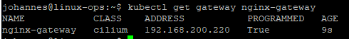

```bash
kubectl get svc cilium-gateway-nginx-gateway
```

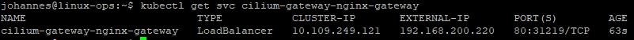

```bash
curl -v http://192.168.200.220
```

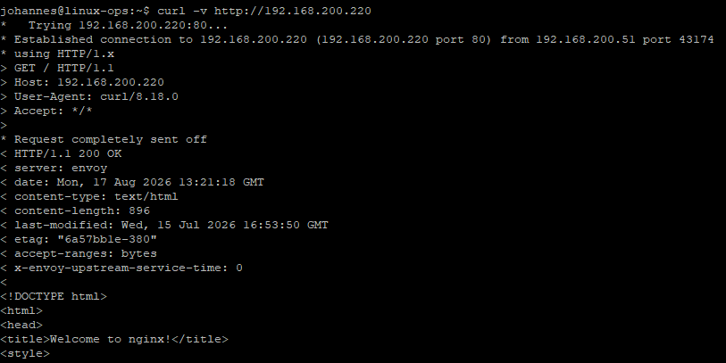

### Check network traffic in Hubble

Expose Hubble UI using port forwarding.

```bash
kubectl -n kube-system port-forward \
  --address 0.0.0.0 \
  service/hubble-ui 12000:80
```

Open a browser and point it to http://`<Your IP here>`:12000/

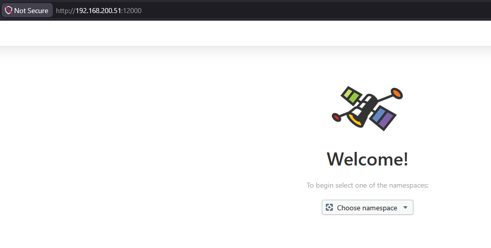

Set the namespace to “default” and create some traffic to your nginx.


