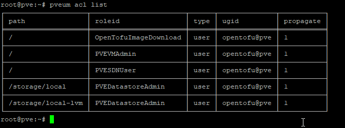
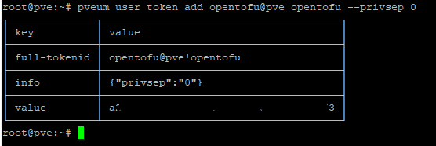
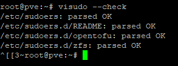
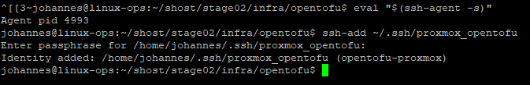
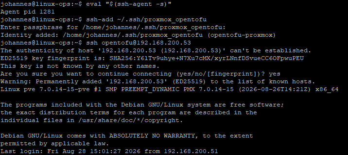
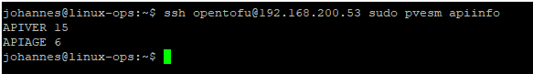

# Stage 02 – Automating the Installation

## Sources

- <https://registry.terraform.io/providers/bpg/proxmox/latest/docs>
- <https://registry.terraform.io/providers/siderolabs/talos/latest/docs>
- <https://www.jonashietala.se/blog/2026/05/22/talos_linux_on_proxmox_with_terraform/>
- <https://opentofu.org/docs/intro/install/standalone/>
- <https://docs.siderolabs.com/talos/v1.13/getting-started/talosctl>

## Prepare a deployment machine

### Install prerequisites

Update the machine:

```bash
sudo apt update
sudo apt upgrade
```

Install unzip, cosign, curl, jq and git:

```bash
sudo apt install unzip cosign curl jq git
```

Install the Talos control binary:

```bash
curl -sL https://talos.dev/install | sh
```

Download kubectl:

```bash
curl -LO "https://dl.k8s.io/release/$(curl -L -s https://dl.k8s.io/release/stable.txt)/bin/linux/amd64/kubectl"
```

Make the binary executable and move it to `/usr/local/bin`:

```bash
sudo install -o root -g root -m 0755 kubectl /usr/local/bin/kubectl
rm kubectl
```

Install Helm:

```bash
curl -fsSL -o get_helm.sh https://raw.githubusercontent.com/helm/helm/main/scripts/get-helm-4
chmod 700 get_helm.sh
./get_helm.sh
rm get_helm.sh
```

Install Cilium CLI:

```bash
CILIUM_CLI_VERSION=$(curl -s https://raw.githubusercontent.com/cilium/cilium-cli/main/stable.txt)
CLI_ARCH=amd64
curl -L --fail --remote-name-all https://github.com/cilium/cilium-cli/releases/download/${CILIUM_CLI_VERSION}/cilium-linux-${CLI_ARCH}.tar.gz{,.sha256sum}
sha256sum --check cilium-linux-${CLI_ARCH}.tar.gz.sha256sum
sudo tar xzvfC cilium-linux-${CLI_ARCH}.tar.gz /usr/local/bin
rm cilium-linux-${CLI_ARCH}.tar.gz{,.sha256sum}
```

Install OpenTofu:

```bash
curl --proto '=https' --tlsv1.2 -fsSL https://get.opentofu.org/install-opentofu.sh -o install-opentofu.sh
```

Inspect the script.

```bash
chmod +x install-opentofu.sh
./install-opentofu.sh --install-method standalone
rm -f install-opentofu.sh
```

## Create Proxmox API Token and setup SSH

Log into the Proxmox node as root via SSH.

Create the Proxmox API user:

```bash
pveum user add opentofu@pve --comment "OpenTofu automation"
```

Create the supplemental role:

```bash
pveum role add OpenTofuImageDownload -privs "Sys.Audit Sys.Modify Datastore.AllocateTemplate"
```

Assign the roles, assuming the datastores are named `local` and `local-lvm`:

```bash
pveum aclmod / -user opentofu@pve -role PVEVMAdmin
pveum aclmod / -user opentofu@pve -role PVESDNUser
pveum aclmod / -user opentofu@pve -role OpenTofuImageDownload
pveum aclmod /storage/local -user opentofu@pve -role PVEDatastoreAdmin
pveum aclmod /storage/local-lvm -user opentofu@pve -role PVEDatastoreAdmin
```

Check the ACLs:

```bash
pveum acl list
```



Create the API token:

```bash
pveum user token add opentofu@pve opentofu --privsep 0
```

Save the returned token secret. With `--privsep 0`, the token uses the permissions of its backing user.



Create a separate Linux/PAM account on every Proxmox node on which the provider may perform SSH operations:

```bash
useradd --create-home --shell /bin/bash opentofu
```

Install sudo:

```bash
apt update
apt install sudo
```

On the **deployment machine**, generate the SSH key:

```bash
ssh-keygen -t ed25519 -a 100 -f ~/.ssh/proxmox_opentofu -C "opentofu-proxmox"
```

Then on each Proxmox node:

```bash
install -d -m 700 -o opentofu -g opentofu /home/opentofu/.ssh
```

Put the contents of:

```text
~/.ssh/proxmox_opentofu.pub
```

from the deployment machine into:

```text
/home/opentofu/.ssh/authorized_keys
```

Set the ownership and permissions explicitly:

```bash
chown opentofu:opentofu /home/opentofu/.ssh/authorized_keys
chmod 600 /home/opentofu/.ssh/authorized_keys
```

Add user to sudoers:

```bash
visudo -f /etc/sudoers.d/opentofu
```

Add:

```text
opentofu ALL=(root) NOPASSWD: /usr/sbin/pvesm
opentofu ALL=(root) NOPASSWD: /usr/sbin/qm
```

Set permissions:

```bash
chmod 0440 /etc/sudoers.d/opentofu
visudo --check
```



On the deployment machine, start an SSH agent and load the key:

```bash
eval "$(ssh-agent -s)"
ssh-add ~/.ssh/proxmox_opentofu
```



Test normal SSH:

```bash
ssh opentofu@192.168.200.53
```



Exit, then test the exact passwordless sudo behavior the provider needs:

```bash
ssh opentofu@192.168.200.53 sudo pvesm apiinfo
```



## Run the automation

The infrastructure is split into independently managed root modules with separate state files:

- `image/` downloads and owns the Talos image in Proxmox.
- `vms/` creates Talos VMs and reads the image file ID from `image/terraform.tfstate`.
- `talos/` configures and bootstraps Talos, then produces the Kubernetes credentials.
- `cilium/` installs Cilium with Helm and waits for the complete cluster to become healthy.
- `cilium-config/` configures the Cilium load-balancer IP pool and L2 announcements.

Destroying one root does not automatically destroy resources owned by another root.

### Clone repo

```bash
git clone https://github.com/johannes-kuhfuss/shost.git
```

### Credentials

The image and VM roots use the provider-native `PROXMOX_VE_API_TOKEN` environment variable. The VM root also uses the local SSH agent with the Linux user configured by `proxmox_ssh_username`.

Edit the setup script and add your Proxmox token, then execute the script:

```bash
source stage02/infra/scripts/setup-opentofu-env.sh
```

### Configuration

Go to the base folder:

```bash
cd stage02/infra/opentofu/
```

Copy the example files using the script:

```bash
../scripts/copy-opentofu-tfvars.sh
```

Edit the files (`terraform.tfvars`) and fill in the correct values.

### Apply

Initialize and apply the roots in dependency order.

Download the image first:

```bash
tofu -chdir=image init
tofu -chdir=image plan
tofu -chdir=image apply
```

Create the VMs:

```bash
tofu -chdir=vms init
tofu -chdir=vms plan
tofu -chdir=vms apply
```

Install Talos:

```bash
tofu -chdir=talos init
tofu -chdir=talos plan
tofu -chdir=talos apply
```

Install Cilium:

```bash
tofu -chdir=cilium init
tofu -chdir=cilium plan
tofu -chdir=cilium apply
```

Configure Cilium:

```bash
tofu -chdir=cilium-config init
tofu -chdir=cilium-config plan
tofu -chdir=cilium-config apply
```

### Store talosconfig and kubeconfig

Extract the configurations with the helper script. Existing files are skipped by default:

```bash
../scripts/extract-talos-config.sh
```

To replace existing `~/.talos/config` and `~/.kube/config` files explicitly, pass the overwrite flag:

```bash
../scripts/extract-talos-config.sh --overwrite
```

## Tests

## Clean-up

Destroy in reverse order so Helm can still reach the Kubernetes API while uninstalling Cilium:

```bash
tofu -chdir=cilium-config destroy
tofu -chdir=cilium destroy
tofu -chdir=talos destroy
tofu -chdir=vms destroy
tofu -chdir=image destroy
```
